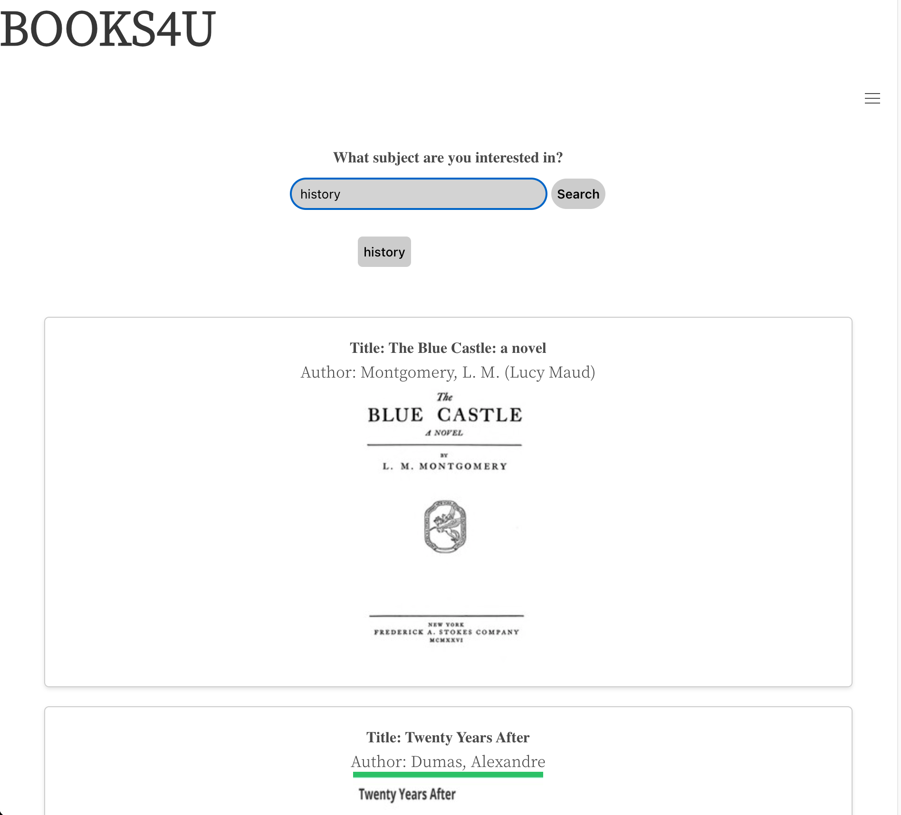
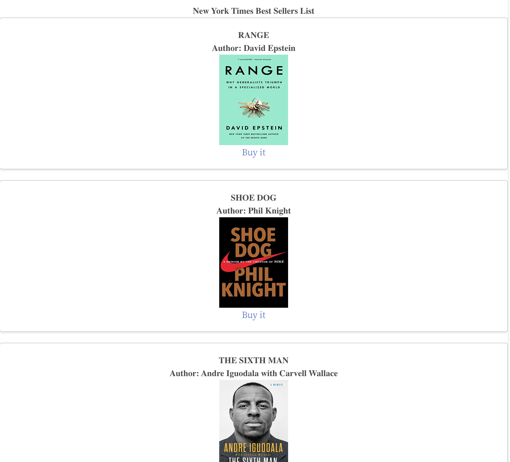

# <BOOKS4U>

## Description

We decided to build a project around a book suggestion dashboard. It would allow us to fetch the bestseller list from the New York Times API and display those initially on the dashboard for the user to see and if anything interests them they can click on a link that would allow them to buy a copy from Amazon. Otherwise the search bar would interact with the Gutendex API and would search the 30 most popular options depending on the subject the user searches. While it is still rudimentary it allowed us to visualise and build a project that interacted with an API to produce an interactive dashboard that also utilized local stoarge functions to callback to previous requests. Furthermore more we learned how to use alternative CSS frameworks such as Bulma to stylize the project.

## Technologies used

The 2 API's used were:

- Gutendex API: <https://gutendex.com/>
- New York API: <https://developer.nytimes.com/apis>

CSS Framework used:
- Bulma <https://bulma.io/>

## Usage

Link to live project: 

## Credits
Collaborators on this project were Niko Auer, Julie Kim, Luke Stanton, Raymond Chen and Hashmi Salim Ali.
Resources used:
- https://gutendex.com/
- https://developer.mozilla.org/en-US/docs/Web/API/Window/localStorage
- https://bulma.io/
- https://developer.nytimes.com/apis
- https://blog.hubspot.com/website/javascript-fetch-api
- <a href="https://www.vecteezy.com/free-vector/image-placeholder">Image Placeholder Vectors by Vecteezy</a>